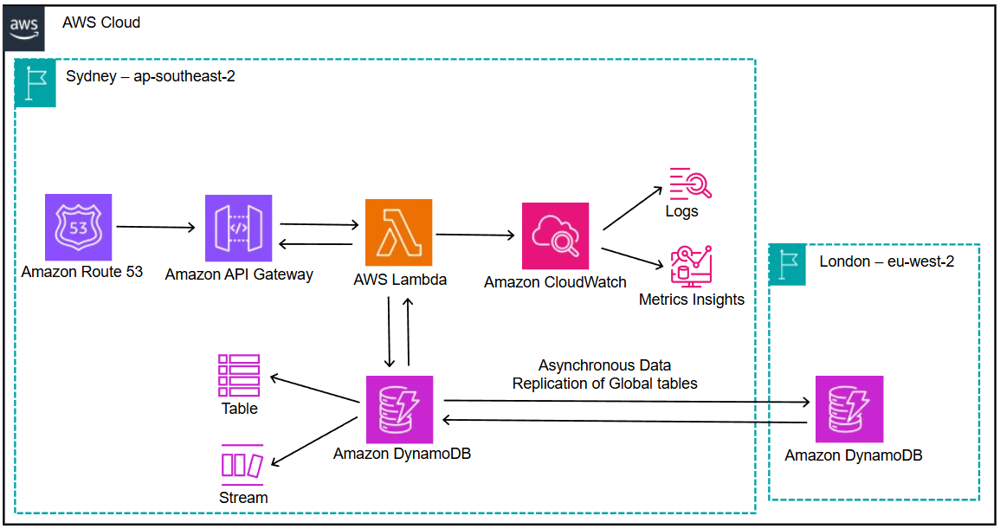

# Artisan Tiling API

  

A serverless enterprise-grade backend API for Artisan Tiling's inventory management system built on AWS Lambda, DynamoDB, and API Gateway.

## 🚀 Quick Start

> **Prerequisites**: 
> - Ubuntu or Ubuntu CLI from WSL 2
> - AWS CLI configured with appropriate credentials
> - Terraform (v1.0.0+)
> - Node.js (v18.x+)
> - Make utility (`sudo apt-get install make`)
> - Zip utility (`sudo apt-get install zip`)
> - Registered domain in Route 53

1. **Clone the repository**
   ```bash
   git clone https://github.com/CaringalML/Artisan-Tiling-Node-JS-Lambda-DynamoDB-Serverless.git
   cd Artisan-Tiling-Node-JS-Lambda-DynamoDB-Serverless
   ```

2. **Configure your environment**
   - Update the `zone_id` in `terraform.tfvars` to match your Route 53 hosted zone ID
   - Modify the CORS origin in both `variables.tf` and `src/index.js` to match your domain

3. **Deploy the application**
   ```bash
   terraform init
   make deploy
   ```

4. **Verify deployment**
   ```bash
   make outputs
   ```

## 🏗️ Architecture Overview



### Enterprise-Grade Features

| Component | Implementation | Benefits |
|-----------|----------------|----------|
| **Compute** | AWS Lambda with Node.js 18.x & Express.js | Serverless scaling, no infrastructure management |
| **API** | Amazon API Gateway with custom domain | Professional endpoint with HTTPS, rate limiting |
| **Database** | DynamoDB with global tables | Multi-region replication, sub-millisecond latency |
| **Monitoring** | CloudWatch + X-Ray | Real-time metrics, traces, and automated alerting |
| **Security** | IAM roles, HTTPS, encryption at rest | Defense-in-depth approach |
| **DevOps** | Terraform, Makefile | Infrastructure as code, consistent deployments |

### AWS Well-Architected Implementation

✅ **Operational Excellence**: Automated deployment with Makefile  
✅ **Security**: Defense-in-depth with IAM, HTTPS, and encryption  
✅ **Reliability**: Multi-region failover with active-active replication  
✅ **Performance**: Serverless architecture with global distribution  
✅ **Cost Optimization**: Pay-per-use with no idle resources  

## 📚 API Reference

### Inventory Management Endpoints

| Method | Endpoint | Description | Request Body | Success Response |
|--------|----------|-------------|--------------|------------------|
| `POST` | `https://serverless.artisantiling.co.nz/inventory` | Create item | `{ "name": "string", "quantity": number, "price": number }` | `201 Created` |
| `GET` | `https://serverless.artisantiling.co.nz/inventory` | List all items | N/A | `200 OK` with array of items |
| `GET` | `https://serverless.artisantiling.co.nz/inventory/{id}` | Get specific item | N/A | `200 OK` with item details |
| `PUT` | `https://serverless.artisantiling.co.nz/inventory/{id}` | Update item | `{ "name": "string", "quantity": number, "price": number }` | `200 OK` with updated item |
| `DELETE` | `https://serverless.artisantiling.co.nz/inventory/{id}` | Delete item | N/A | `204 No Content` |

### Testing with Postman

For testing the API endpoints in Postman:

1. **Set Headers**:
   ```
   Content-type: application/json
   ```

2. **Sample Request Body (POST or PUT)**:
   ```json
   {
     "name": "Porcelain Tile 60x60cm",
     "category": "Tiles",
     "quantity": 100,
     "price": 24.99,
     "description": "High-quality porcelain floor tiles",
     "sku": "TILE-P6060"
   }
   ```

3. **Example POST Request** (Create new item):
   - URL: `https://serverless.artisantiling.co.nz/inventory`
   - Method: POST
   - Headers: Content-type: application/json
   - Body: Raw JSON (sample above)

4. **Example GET Request** (List all items):
   - URL: `https://serverless.artisantiling.co.nz/inventory`
   - Method: GET
   - No body required

5. **Example GET Request** (Get specific item):
   - URL: `https://serverless.artisantiling.co.nz/inventory/943c07f7-1acb-4bfb-8b6e-be551029cb1f`
   - Method: GET
   - No body required

6. **Example PUT Request** (Update specific item):
   - URL: `https://serverless.artisantiling.co.nz/inventory/943c07f7-1acb-4bfb-8b6e-be551029cb1f`
   - Method: PUT
   - Headers: Content-type: application/json
   - Body: Raw JSON (sample above with modified values)

7. **Example DELETE Request** (Remove specific item):
   - URL: `https://serverless.artisantiling.co.nz/inventory/943c07f7-1acb-4bfb-8b6e-be551029cb1f`
   - Method: DELETE
   - No body required

## 📁 Project Structure

```
├── src/                      # Application source code
│   ├── index.js              # Main entry point and Express app
│   ├── package.json          # Node.js dependencies
│   └── package-lock.json     # Locked dependencies
│
│── api_gateway.tf        # API Gateway configuration
│── cloudwatch.tf         # Monitoring and logging
│── custom_domain.tf      # Domain and certificate management
├── dynamodb.tf           # Database configuration
│── iam.tf                # Security permissions
│── lambda.tf             # Function configuration
│── outputs.tf            # Output variables
│── provider.tf           # AWS provider settings
│── route53.tf            # DNS configuration
│── terraform.tfvars      # Environment variables
│── variables.tf          # Input variables
│
├── Makefile                  # Deployment automation
└── README.md                 # Documentation
```

## 🛠️ Development Guide

### Local Development Setup

1. **Install dependencies**
   ```bash
   make install
   ```

2. **Prepare for deployment**
   ```bash
   make package
   ```

### Makefile Commands

| Command | Description |
|---------|-------------|
| `make install` | Install dependencies |
| `make package` | Create Lambda deployment package |
| `make terraform` | Apply Terraform configuration |
| `make deploy` | Full deployment (package + terraform) |
| `make clean` | Remove build artifacts |
| `make verify` | Verify environment setup |
| `make outputs` | Display deployment outputs |
| `make destroy` | Remove all deployed resources |

## 🔧 Configuration

### Environment Variables

| Variable | Description | Default |
|----------|-------------|---------|
| `INVENTORY_TABLE_NAME` | Inventory items table | `inventory-items` |
| `ENVIRONMENT` | Deployment environment | `production` |
| `CORS_ORIGIN` | Allowed origin for CORS | Your domain |

### Regional Deployment

The application deploys to:
- Primary: **ap-southeast-2** (Sydney)
- Secondary: **eu-west-2** (London)

## 🔒 Security Features

- **Authorization**: IAM role-based access control
- **Data Protection**: DynamoDB encryption at rest
- **Transport Security**: HTTPS only with TLS 1.2+
- **API Protection**: Throttling limits for requests

## 🚨 Monitoring & Alerts

- **CloudWatch Dashboards**: Pre-configured with key metrics
- **CloudWatch Alarms**: Automatic notifications for:
  - High error rates (>1%)
  - Elevated latency (>500ms p95)
  - Lambda function errors
  - Throttling events

- **X-Ray Tracing**: End-to-end request visualization
- **CloudWatch Logs**: Structured logging with retention policy

## 🔄 Deployment Automation

Deployment is fully automated through the included Makefile, which provides a streamlined approach to:
1. **Package Creation**: Generate Lambda deployment bundle
2. **Infrastructure Deployment**: Apply Terraform changes
3. **Verification**: Confirm successful deployment

This approach eliminates the need for complex CI/CD pipelines while still providing reproducible deployments.

## 🔄 Disaster Recovery

| Strategy | Implementation | RPO | RTO |
|----------|----------------|-----|-----|
| Active-Active | Multi-region deployment | ~1 sec | ~30 sec |
| Backup | DynamoDB PITR | 5 min | ~15 min |

## 📋 Requirements

- Ubuntu or Ubuntu CLI from WSL 2
- Node.js 18.x or newer
- AWS CLI with configured credentials
- Terraform 1.0.0 or newer
- Make utility (`sudo apt-get install make`)
- Zip utility (`sudo apt-get install zip`)
- Registered domain in Route 53

## 📝 License

This project is licensed under the ISC License.

## 📞 Contact

**Artisan Tiling**  
Hamilton, New Zealand  
[lawrencecaringal5@gmail.com](lawrencecaringal5@gmail.com)  
[artisantiling.co.nz](https://artisantiling.co.nz)